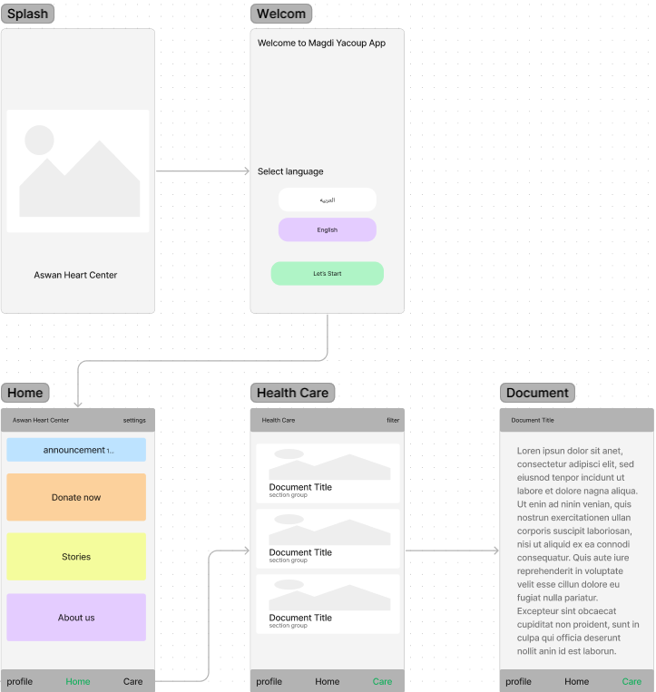
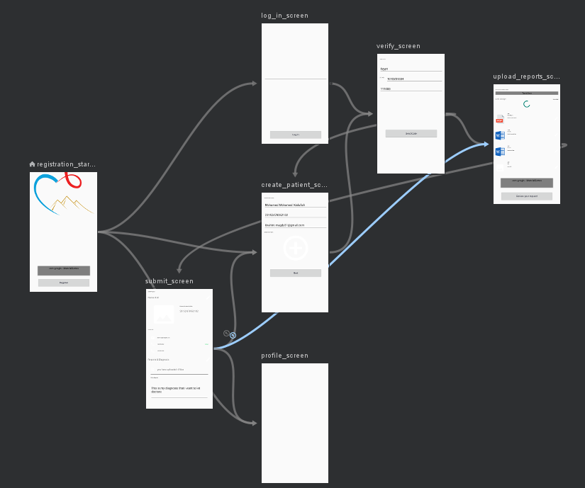

# Magdi Yacoup - Aswan Heart Center App

### Features

 * Navigation Component
 * Datastore
 * Buffer Protocol
 * Room Database
 * Retrofit
 * Hilt Dependency Injection
 * MVVM Architecture

## On Boarding Screens

## Registration Screens
    
    1- Main Screen
    2- Login Screen
    3- Create Patient Screen
    4- Verify Phone Number Screen
    5- Upload Reports Screen
    6- Submit Screen

Full Project On [Figma](https://www.figma.com/file/nq14l5HxMpmyyB3RxYipml/Aswan-Heart-Center---MYF?node-id=0%3A1&t=IexS0Cuqj9iGI7Kx-0), [Prototype](https://www.figma.com/proto/nq14l5HxMpmyyB3RxYipml/Aswan-Heart-Center---MYF?node-id=10%3A201&scaling=scale-down&page-id=0%3A1&starting-point-node-id=24%3A96)
