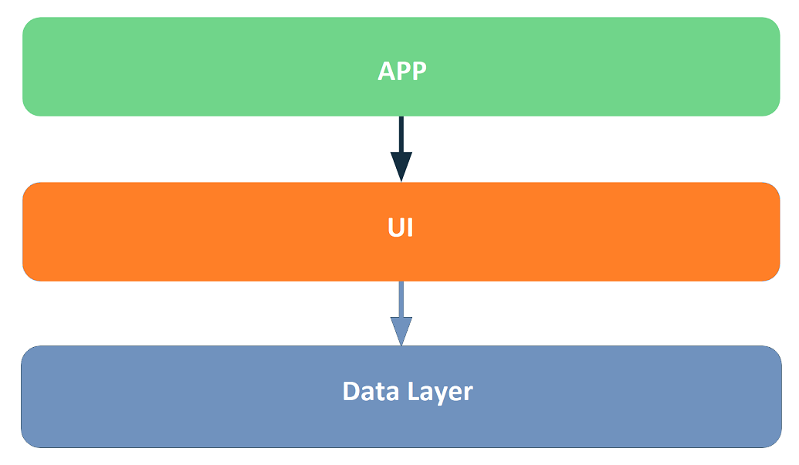

# Magdi Yacoup - Aswan Heart Center App

### Features

 * Navigation Component
 * Datastore
 * [Protocol Buffer](https://developers.google.com/protocol-buffers/docs/proto3#simple)
 * Room Database
 * Retrofit
 * Hilt Dependency Injection
 * MVVM Architecture [recommended architecture](https://developer.android.com/topic/architecture)
 * [Modularization](https://developer.android.com/topic/modularization)

Please Install the latest version of Android Studio [Electric Eel](https://developer.android.com/studio)

#### Developer Note
    Currently i'm working on refactor the Modules to make a clean architecture.
    I'm using Firebase Storage to upload files and Phone Auth to verify patient's phone number,
    considering to implement Twilio SMS service and  DigitalOceans Spaces S3 AWS as Alternative
    services.
    Some screens need refactoring "i'll add comments on code", next stage is to test The
    application. Thank you! 

### Modularization
    We have here the base code in app module, 
    UI Layer in :feature
    and data layers in :core
    any resourses related to UI (like strings,drawable,colors ..) In :ui Module
 The App structure follows this [Pattern](https://developer.android.com/topic/modularization/patterns) 
    

## On Boarding Screens

## Registration Screens
    
    1- Main Screen
    2- Login Screen
    3- Create Patient Screen
    4- Verify Phone Number Screen
    5- Upload Reports Screen
    6- Submit Screen
    7- Profile Screen

Full Project On [Figma](https://www.figma.com/file/nq14l5HxMpmyyB3RxYipml/Aswan-Heart-Center---MYF?node-id=0%3A1&t=IexS0Cuqj9iGI7Kx-0), [Prototype](https://www.figma.com/proto/nq14l5HxMpmyyB3RxYipml/Aswan-Heart-Center---MYF?node-id=10%3A201&scaling=scale-down&page-id=0%3A1&starting-point-node-id=24%3A96) enjoy the experience.
