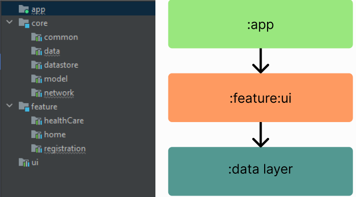
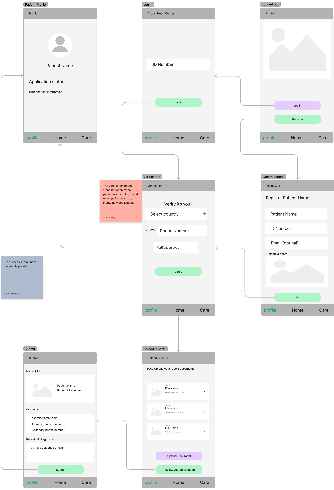

# Magdi Yacoup - Aswan Heart Center App

Application on [PlayStore](https://play.google.com/store/apps/details?id=org.myf.demo)

### Features

 * Navigation Component
 * Datastore
 * [Protocol Buffer](https://developers.google.com/protocol-buffers/docs/proto3#simple)
 * Room Database
 * Retrofit
 * Hilt Dependency Injection
 * MVVM Architecture [recommended architecture](https://developer.android.com/topic/architecture)
 * [Modularization](https://developer.android.com/topic/modularization)

Please Install the latest version of Android Studio [Electric Eel](https://developer.android.com/studio)

### Modularization
    We have here the base code in app module, 
    UI Layer in :feature
    and data layer in :core
    any resourses related to UI (like strings,drawable,colors ..) In :ui Module
 The App structure follows this [Pattern](https://developer.android.com/guide/navigation/navigation-multi-module) 
    

## Phone Verification Flow

## On Boarding Screens

## Registration Screens
    
    1- Main Screen
    2- Login Screen
    3- Create Patient Screen
    4- Verify Phone Number Screen
    5- Upload Reports Screen
    6- Submit Screen
    7- Profile Screen

Full Project On [Figma](https://www.figma.com/file/alBLJjvLJK5gSl1RKs8CdK/Aswan-Heart-Center-Flow--MYF?node-id=414%3A523&t=Q8kesgu70uRr7x12-1), [Prototype](https://www.figma.com/proto/nq14l5HxMpmyyB3RxYipml/Aswan-Heart-Center---MYF?node-id=10%3A201&scaling=scale-down&page-id=0%3A1&starting-point-node-id=24%3A96) enjoy the experience.
